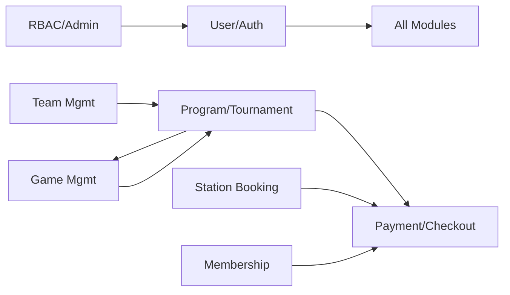

# NexGen Esports v2 — Full System Audit & Simplification Plan

## System Overview

This is a **Java Servlet + JSP + MySQL** web application for a university esports club. It uses the classic **MVC pattern** with Model → DAO → Service → Controller(Servlet) → JSP layers.

**Current overall file count:**

| Layer | Files |
|---|---|
| Models | 24 |
| DAOs | 44 (22 interfaces + 22 impls) |
| Services | 14 |
| Controllers (Servlets) | 45 |
| JSPs | 35 (incl. shared header/footer/sidebar) |
| Utilities | 3 |
| CSS | 1 |
| Database SQL | 1 |
| **Total Java + JSP** | **~166 files** |

---

## 1. Module Inventory & Progress

### Module Dependency Map (least → most dependent)



---

### 📊 Module Progress Summary

| # | Module | Backend Files | Frontend (JSP) | DB Tables | Progress | Dependencies |
|---|---|---|---|---|---|---|
| 1 | **Game Management** | 5 | 3 | 1 | 🟢 90% | None (independent) |
| 2 | **User & Auth** | 8 | 3 | 3 | 🟢 85% | None (foundation) |
| 3 | **Membership & Pass** | 19 | 2 | 6 | 🟢 85% | User, Payment |
| 4 | **Station Booking** | 22 | 6 | 2 | 🟡 75% | User, Station, Payment |
| 5 | **Team Management** | 19 | 4 | 5 | 🟢 80% | User |
| 6 | **Program & Tournament** | 41 | 8 | 8 | 🟡 65% | User, Game, Team, Payment |
| 7 | **Admin / RBAC** | 3 | 0 | 4 | 🔴 30% | User |
| — | **Shared/General** | 6 | 5 | — | 🟢 90% | — |

---

## 2. Per-Module Breakdown

---

### Module 1: 🎮 Game Management (Most Independent)

**DB Tables:** `game`
**Dependencies:** None — safest to start with

| Layer | Files | Status |
|---|---|---|
| Model | [Game.java](file:///d:/nexgenesportsv2-1/src/main/java/my/nexgenesports/model/Game.java) | ✅ Complete |
| DAO Interface | [GameDao.java](file:///d:/nexgenesportsv2-1/src/main/java/my/nexgenesports/dao/programTournament/GameDao.java) | ✅ Complete |
| DAO Impl | [GameDaoImpl.java](file:///d:/nexgenesportsv2-1/src/main/java/my/nexgenesports/dao/programTournament/GameDaoImpl.java) | ✅ Complete |
| Service | [GameService.java](file:///d:/nexgenesportsv2-1/src/main/java/my/nexgenesports/service/programTournament/GameService.java) | ✅ Complete |
| Controller | [GameServlet.java](file:///d:/nexgenesportsv2-1/src/main/java/my/nexgenesports/controller/programTournament/GameServlet.java) | ✅ Complete |

**Pages:**

| Page | JSP File | HTML | CSS | JS | Status |
|---|---|---|---|---|---|
| Game List | [gameList.jsp](file:///d:/nexgenesportsv2-1/src/main/webapp/gameList.jsp) | ✅ | ⚠️ No styled table classes | — | 🟡 Functional, unstyled |
| Game Details | [gameDetails.jsp](file:///d:/nexgenesportsv2-1/src/main/webapp/gameDetails.jsp) | ✅ | ⚠️ Missing layout styles | — | 🟡 Functional, unstyled |
| Game Form (New/Edit) | [gameForm.jsp](file:///d:/nexgenesportsv2-1/src/main/webapp/gameForm.jsp) | ✅ | ⚠️ Missing layout styles | — | 🟡 Functional, unstyled |

> [!WARNING]
> All 3 Game pages have **broken layout**: sidebar is included but not wrapped in proper `.container > .sidebar` structure. No `.content` wrapper on some. No styled table CSS class applied.

**Current file count: 5 Java + 3 JSP = 8 files**

---

### Module 2: 👤 User & Authentication

**DB Tables:** `users`, `roles`, `positions`, `role_positions`
**Dependencies:** None — foundation module

| Layer | Files | Status |
|---|---|---|
| Model | [User.java](file:///d:/nexgenesportsv2-1/src/main/java/my/nexgenesports/model/User.java) | ✅ Complete |
| DAO | [UserDao.java](file:///d:/nexgenesportsv2-1/src/main/java/my/nexgenesports/dao/user/UserDao.java) | ✅ Complete (no interface/impl split) |
| DAO | [RolePositionDao.java](file:///d:/nexgenesportsv2-1/src/main/java/my/nexgenesports/dao/user/RolePositionDao.java) | ✅ Complete (no interface/impl split) |
| Service | [UserService.java](file:///d:/nexgenesportsv2-1/src/main/java/my/nexgenesports/service/user/UserService.java) | ✅ Complete |
| Controller | [LoginServlet.java](file:///d:/nexgenesportsv2-1/src/main/java/my/nexgenesports/controller/user/LoginServlet.java) | ✅ Complete |
| Controller | [LogoutServlet.java](file:///d:/nexgenesportsv2-1/src/main/java/my/nexgenesports/controller/user/LogoutServlet.java) | ✅ Complete |
| Controller | [RegisterServlet.java](file:///d:/nexgenesportsv2-1/src/main/java/my/nexgenesports/controller/user/RegisterServlet.java) | ✅ Complete |
| Controller | [PaymentCallbackServlet.java](file:///d:/nexgenesportsv2-1/src/main/java/my/nexgenesports/controller/user/PaymentCallbackServlet.java) | ✅ Complete |

**Pages:**

| Page | JSP File | HTML | CSS | JS | Status |
|---|---|---|---|---|---|
| Login | [login.jsp](file:///d:/nexgenesportsv2-1/src/main/webapp/login.jsp) | ✅ | ✅ | ✅ (eye toggle) | 🟢 Complete |
| Register | [register.jsp](file:///d:/nexgenesportsv2-1/src/main/webapp/register.jsp) | ✅ | ⚠️ Uses `.login-container` styles | ✅ | 🟡 Functional (needs own CSS) |
| Dashboard | [dashboard.jsp](file:///d:/nexgenesportsv2-1/src/main/webapp/dashboard.jsp) | ✅ | ✅ | ✅ | 🟢 Complete (basic) |

**Missing pages:**
- ❌ `manageProfile` page — sidebar links to `/manageProfile` but no JSP exists
- ❌ `inGameProfile` page — sidebar links to `/inGameProfile` but no JSP exists
- ❌ Password reset page — `reset.jsp` exists but is a DB reset page, not user-facing

**Current file count: 8 Java + 3 JSP = 11 files**

---

### Module 3: 🏅 Membership & Gaming Pass

**DB Tables:** `membershipsessions`, `club_benefits`, `userclubmemberships`, `monthlygamingpasstiers`, `pass_benefits`, `usergamingpasses`
**Dependencies:** User, Payment (Checkout)

| Layer | Files | Status |
|---|---|---|
| Models (6) | MembershipSession, ClubBenefit, UserClubMembership, PassTier, PassBenefit, UserGamingPass | ✅ All Complete |
| DAOs (12) | 6 Interface + 6 Impl files | ✅ All Complete |
| Services (2) | MembershipService, PassService | ✅ All Complete |
| Controllers (3) | ManageMembershipServlet, PayMembershipServlet, PayPassServlet | ✅ All Complete |

**Pages:**

| Page | JSP File | HTML | CSS | JS | Status |
|---|---|---|---|---|---|
| Manage Membership & Pass | [manageMembership.jsp](file:///d:/nexgenesportsv2-1/src/main/webapp/manageMembership.jsp) | ✅ | ✅ | ✅ (tab switcher) | 🟢 Complete |
| Checkout | [checkout.jsp](file:///d:/nexgenesportsv2-1/src/main/webapp/checkout.jsp) | ✅ | ✅ | — | 🟢 Complete (shared) |

**Current file count: 23 Java + 2 JSP = 25 files** ← Highest file count for a relatively simple feature

---

### Module 4: 🕹️ Station Booking (Multiplayer Lounge)

**DB Tables:** `gamingstation`, `gamingstationbooking`, `business_config`
**Dependencies:** User, Payment/Checkout

| Layer | Files | Status |
|---|---|---|
| Models (2) | Booking, Station | ✅ Complete |
| DAOs (4) | BookingDao, StationDao, BusinessConfigDao + Impl | ✅ Complete |
| Services (3) | BookingService, StationService, BusinessConfigService | ✅ Complete |
| Controllers (12) | AddStation, BookStation, BookingDetails, BusinessConfig, DeleteBooking, DeleteStation, EditStation, ListBookings, ListStations, ManageBooking, SelectStation, UpdateBooking | ✅ Complete |

**Pages:**

| Page | JSP File | HTML | CSS | JS | Status |
|---|---|---|---|---|---|
| Select Station | [selectStation.jsp](file:///d:/nexgenesportsv2-1/src/main/webapp/selectStation.jsp) | ✅ | ✅ | ✅ (station change handler) | 🟢 Complete |
| Book Station | [bookStation.jsp](file:///d:/nexgenesportsv2-1/src/main/webapp/bookStation.jsp) | ✅ | ✅ | ✅ (slot validation) | 🟢 Complete |
| Manage My Bookings | [manageBooking.jsp](file:///d:/nexgenesportsv2-1/src/main/webapp/manageBooking.jsp) | ✅ | ⚠️ Uses `.stations-table` (undefined) | — | 🟡 Table unstyled |
| Manage All Bookings | [manageBookings.jsp](file:///d:/nexgenesportsv2-1/src/main/webapp/manageBookings.jsp) | ✅ | ⚠️ Uses `.stations-table` (undefined) | — | 🟡 Table unstyled |
| Booking Details | [bookingDetails.jsp](file:///d:/nexgenesportsv2-1/src/main/webapp/bookingDetails.jsp) | ✅ | ⚠️ Basic | — | 🟡 Functional, basic |
| Manage Stations | [manageStations.jsp](file:///d:/nexgenesportsv2-1/src/main/webapp/manageStations.jsp) | ✅ | ⚠️ Uses `.stations-table` (undefined) | — | 🟡 Table unstyled |
| Station Add/Edit Form | [stationForm.jsp](file:///d:/nexgenesportsv2-1/src/main/webapp/stationForm.jsp) | ✅ | ⚠️ No form styling | — | 🟡 Functional, unstyled |
| Business Hours Config | [businessHours.jsp](file:///d:/nexgenesportsv2-1/src/main/webapp/businessHours.jsp) | ✅ | ⚠️ No layout at all | — | 🔴 Bare HTML |

> [!IMPORTANT]  
> **12 servlets** for booking is excessive. Many are single-action servlets for CRUD. This is the best candidate for consolidation.

**Current file count: 21 Java + 8 JSP = 29 files**

---

### Module 5: 👥 Team Management

**DB Tables:** `team`, `teammember`, `join_request`, `archivedteam`, `archived_teammember`, `auditlog`  
**Dependencies:** User

| Layer | Files | Status |
|---|---|---|
| Models (5) | Team, TeamMember, JoinRequest, ArchivedTeam, AuditLog | ✅ Complete |
| DAOs (10) | 5 Interface + 5 Impl | ✅ Complete |
| Services (1) | TeamService (large, 20KB) | ✅ Complete |
| Controllers (7) | JoinRequestList, JoinRequest, TeamCreate, TeamDetail, TeamList, TeamManage, TeamRemove | ✅ Complete |

**Pages:**

| Page | JSP File | HTML | CSS | JS | Status |
|---|---|---|---|---|---|
| My Teams (Manage) | [manageTeam.jsp](file:///d:/nexgenesportsv2-1/src/main/webapp/manageTeam.jsp) | ✅ | ✅ | ✅ (panel/tab switching) | 🟢 Complete |
| Team List | [teamList.jsp](file:///d:/nexgenesportsv2-1/src/main/webapp/teamList.jsp) | ✅ | ⚠️ Inline styles, raw HTML table | — | 🟡 Functional, unstyled |
| Create Team | [teamCreate.jsp](file:///d:/nexgenesportsv2-1/src/main/webapp/teamCreate.jsp) | ✅ | ⚠️ No form styling | — | 🟡 Functional, unstyled |
| Join Requests | [joinRequests.jsp](file:///d:/nexgenesportsv2-1/src/main/webapp/joinRequests.jsp) | ✅ | ⚠️ Raw HTML table | — | 🟡 Functional, unstyled |

**Current file count: 23 Java + 4 JSP = 27 files**

---

### Module 6: 🏆 Program & Tournament (Most Complex)

**DB Tables:** `program_tournament`, `tournament_participant`, `bracket`, `bracket_match`, `bracket_referee`, `challonge_tournament`, `challonge_participant`, `merit_level`, `merit_score`  
**Dependencies:** User, Game, Team, Payment

| Layer | Files | Status |
|---|---|---|
| Models (8) | ProgramTournament, TournamentParticipant, Bracket, BracketMatch, BracketReferee, ChallongeTournament, MeritEntry, MeritLevel, MeritScore | ✅ Complete |
| DAOs (18) | 9 Interface + 9 Impl | ✅ Complete |
| Services (5) | ProgramTournamentService, BracketService, BracketUtils, GameService, ChallongeClient | ✅ Complete |
| Controllers (16) | 5 Bracket + 11 ProgramTournament servlets | ✅ Complete |

**Pages:**

| Page | JSP File | HTML | CSS | JS | Status |
|---|---|---|---|---|---|
| Program List | [programList.jsp](file:///d:/nexgenesportsv2-1/src/main/webapp/programList.jsp) | ✅ | ⚠️ Inline styles | ⚠️ None | 🟡 Functional, basic |
| Program Create | [programCreate.jsp](file:///d:/nexgenesportsv2-1/src/main/webapp/programCreate.jsp) | ✅ | ⚠️ Wrong CSS link (`/static/css/main.css`) | ✅ (type toggle) | 🔴 CSS broken |
| Program Edit | [programEdit.jsp](file:///d:/nexgenesportsv2-1/src/main/webapp/programEdit.jsp) | ⚠️ Incomplete (fields omitted) | ⚠️ No form styling | — | 🔴 Incomplete |
| Program Detail | [programDetail.jsp](file:///d:/nexgenesportsv2-1/src/main/webapp/programDetail.jsp) | ✅ | ⚠️ No styling on detail table | — | 🟡 Functional, unstyled |
| Approve Programs | [approvePrograms.jsp](file:///d:/nexgenesportsv2-1/src/main/webapp/approvePrograms.jsp) | ✅ | ⚠️ Wrong CSS link (`/css/main.css`) | — | 🔴 CSS broken |
| Bracket Create | [bracketCreate.jsp](file:///d:/nexgenesportsv2-1/src/main/webapp/bracketCreate.jsp) | ✅ | ⚠️ No form styling | — | 🟡 Functional, unstyled |
| Bracket Edit | [bracketEdit.jsp](file:///d:/nexgenesportsv2-1/src/main/webapp/bracketEdit.jsp) | ✅ | ⚠️ No form styling | — | 🟡 Functional, unstyled |
| Bracket View | [bracketView.jsp](file:///d:/nexgenesportsv2-1/src/main/webapp/bracketView.jsp) | ✅ | ✅ Uses `.summary-table` | — | 🟡 Mostly styled |

**Missing pages:**
- ❌ Team selection page for tournament registration (`/programs/selectTeam`)
- ❌ Registration preview page (`/programs/previewRegistration`)
- ❌ Tournament payment page (`/programs/pay`)

**Current file count: 47 Java + 8 JSP = 55 files** ← Largest module

---

### Module 7: 🔐 Admin / RBAC

**DB Tables:** `pages`, `permissions`, `roles`, `positions`, `role_positions`  
**Dependencies:** User

| Layer | Files | Status |
|---|---|---|
| Util | PermissionChecker, RoleUtils | ✅ Complete |
| Controller | AuthFilter, CsrfFilter | ✅ Complete |

**Pages:**

| Page | JSP File | HTML | CSS | JS | Status |
|---|---|---|---|---|---|
| RBAC Management | ❌ No `manageRBAC.jsp` exists | — | — | — | 🔴 Not started |
| Notifications | ❌ No page exists | — | — | — | 🔴 Not started |
| Audit Log | ❌ No page exists | — | — | — | 🔴 Not started |

> [!CAUTION]
> Sidebar references `/notifications`, `/auditLog`, and `/manageRBAC.jsp` — **NONE of these pages exist yet**.

**Current file count: 3 Java + 0 JSP = 3 files**

---

### Shared / General

| File | Purpose | Status |
|---|---|---|
| [header.jsp](file:///d:/nexgenesportsv2-1/src/main/webapp/header.jsp) | Top bar with logo & username | ✅ Complete |
| [footer.jsp](file:///d:/nexgenesportsv2-1/src/main/webapp/footer.jsp) | Bottom bar | ✅ Complete |
| [sidebar.jsp](file:///d:/nexgenesportsv2-1/src/main/webapp/sidebar.jsp) | Navigation with RBAC checks | ✅ Complete |
| [styles.css](file:///d:/nexgenesportsv2-1/src/main/webapp/styles.css) | Single stylesheet (748 lines) | 🟡 Covers ~60% of pages |
| [PaymentRedirectServlet](file:///d:/nexgenesportsv2-1/src/main/java/my/nexgenesports/controller/general/PaymentRedirectServlet.java) | Mock payment gateway redirect | ✅ Complete |
| [PaymentService](file:///d:/nexgenesportsv2-1/src/main/java/my/nexgenesports/service/general/PaymentService.java) | Payment simulation logic | ✅ Complete |
| [ServiceException](file:///d:/nexgenesportsv2-1/src/main/java/my/nexgenesports/service/general/ServiceException.java) | Custom exception | ✅ Complete |
| [DBConnection](file:///d:/nexgenesportsv2-1/src/main/java/my/nexgenesports/util/DBConnection.java) | JDBC connection pool | ✅ Complete |

---

## 3. Simplification Strategy

### Current Architecture (per module)

Each module currently follows this pattern of **up to 5 layers**:

```
Model → DAO Interface → DAO Impl → Service → Servlet(s) → JSP
```

### Proposed Simplified Architecture

```
Model → DAO (merged) → Service → Servlet (consolidated) → JSP
```

### 🔧 Change 1: Merge DAO Interface + Impl → Single DAO class

**Rationale:** You only have ONE implementation per interface. The interface adds zero value here.

| Module | Interfaces to Remove | Files Saved |
|---|---|---|
| Membership | 6 interfaces | **-6** |
| Program/Tournament | 9 interfaces | **-9** |
| Team | 5 interfaces | **-5** |
| Booking | 1 interface | **-1** |
| **Total** | | **-21 files** |

**How:** For each pair (e.g., `ClubBenefitsDao.java` + `ClubBenefitsDaoImpl.java`), rename Impl to Dao name and delete the interface.

---

### 🔧 Change 2: Consolidate single-action Servlets into multi-action Servlets

Many modules have one servlet per CRUD action. We can merge them into one servlet that dispatches by `action` parameter or URL path.

| Module | Current Servlets | After Merge | Files Saved |
|---|---|---|---|
| Booking | 12 servlets | 3 (BookingServlet, StationServlet, ConfigServlet) | **-9** |
| Program | 11 servlets | 1 (ProgramServlet) | **-10** |
| Bracket | 5 servlets | 1 (BracketServlet) | **-4** |
| Team | 7 servlets | 2 (TeamServlet, JoinRequestServlet) | **-5** |
| User | 4 servlets | 2 (AuthServlet, PaymentCallbackServlet) | **-2** |
| **Total** | | | **-30 files** |

---

### 🔧 Change 3: Remove unused/duplicate Models

| Model | Issue | Action |
|---|---|---|
| `MeritEntry.java` | Not referenced anywhere in code | **Delete** |
| `ChallongeTournament.java` | Challonge integration not wired up | Keep but deprioritize |
| `ArchivedTeam.java` | Only used for soft-delete archiving | Keep |

**Files saved: -1**

---

### 📊 Simplification Summary

| Change | Files Removed |
|---|---|
| Merge DAO Interface + Impl | -21 |
| Consolidate Servlets | -30 |
| Remove unused models | -1 |
| **Total files saved** | **-52 files** |
| **Current total** | ~166 |
| **After simplification** | **~114 files** |

> [!IMPORTANT]
> This is a **31% reduction** in file count with **zero functionality loss**.

---

## 4. Recommended Build Order (Independent → Dependent)

Based on dependency analysis, here is the recommended order to tackle each module:

### Phase 1: Foundation (No Cross-Module Dependencies)
1. **🎮 Game Management** — 8 files, independent, mostly done. Fix CSS/layout on 3 pages.
2. **👤 User & Auth** — 11 files, foundation. Create missing profile pages.

### Phase 2: Mid-Level (Depends on User only)
3. **🔐 Admin / RBAC** — 3 files, depends only on User. Build RBAC management page, audit log, notifications.
4. **👥 Team Management** — 27 files, depends on User. Fix CSS on 3 pages.

### Phase 3: Complex (Multiple Dependencies)
5. **🏅 Membership & Pass** — 25 files, depends on User + Payment. Already mostly complete.
6. **🕹️ Station Booking** — 29 files, depends on User + Station + Payment. Fix `.stations-table` CSS, complete business hours page.
7. **🏆 Program & Tournament** — 55 files, depends on everything. Fix broken CSS links, complete programEdit, build missing registration pages.

---

## 5. Cross-Cutting Issues To Fix Across All Modules

| Issue | Affected Pages | Fix |
|---|---|---|
| `.stations-table` CSS class used but never defined | manageBooking, manageBookings, manageStations | Add to `styles.css` |
| Wrong CSS link (`/static/css/main.css` or `/css/main.css`) | programCreate, approvePrograms | Change to `styles.css` |
| Missing `<!DOCTYPE html>` and `<html>` wrapper | gameList, gameDetails, gameForm, manageStations, manageBookings, programList | Add proper HTML structure |
| Inconsistent sidebar include (some use `<%@ include %>`, some `<jsp:include>`) | Multiple pages | Standardize to `<jsp:include>` |
| No `open-toggle` / `close-toggle` buttons | Multiple pages | Add sidebar toggle to all authenticated pages |
| Pages referenced in sidebar but don't exist | manageProfile, inGameProfile, notifications, auditLog | Create or remove from sidebar |

---

## Open Questions

> [!IMPORTANT]
> **Q1:** Do you want to start the simplification (merging DAOs + consolidating servlets) BEFORE fixing existing pages, or fix pages first on the current architecture?

> [!IMPORTANT]
> **Q2:** For the missing pages (Profile, In-Game Profile, Notifications, Audit Log, RBAC Management), do you want full implementations or placeholder pages first?

> [!IMPORTANT]
> **Q3:** Shall I start with **Module 1 (Game Management)** — fixing the CSS/layout on its 3 pages as a quick win — and then apply the same pattern to all other modules?

## Verification Plan

### Automated Tests
- Build the project with `mvn clean package` after each module change
- Start Docker containers and test each URL endpoint

### Manual Verification
- Navigate through each page flow in the browser
- Verify CSS renders correctly (tables, forms, buttons)
- Test CRUD operations end-to-end for each module
